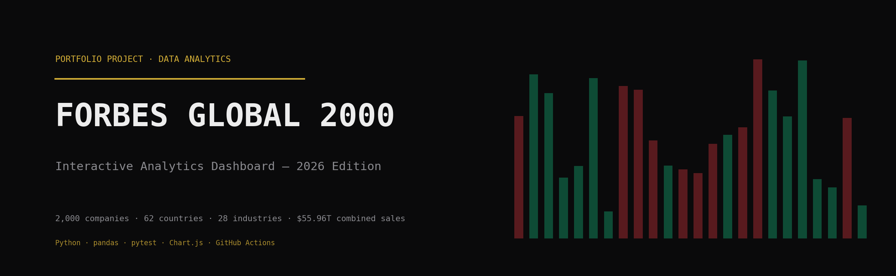

<p align="center">
  
</p>

# Forbes Global 2000 (2026) — Analytics Dashboard

[](https://github.com/hashtro9-rgb/ForbesAnalysis/actions/workflows/deploy.yml)
[](LICENSE)
[](requirements.txt)
[](tests/test_data_quality.py)

An end-to-end analytics project on the world's 2,000 largest public companies: a documented Python cleaning pipeline, automated data-quality tests, an exploratory analysis notebook, and a self-contained interactive dashboard with live filters and computed insights — continuously deployed to GitHub Pages.

**🔗 Live Dashboard: [hashtro9-rgb.github.io/ForbesAnalysis](https://hashtro9-rgb.github.io/ForbesAnalysis/)**

---

## Overview

| Stage | Deliverable | Tooling |
|---|---|---|
| **Data cleaning** | Raw Kaggle export (2000 × 8) → cleaned dataset (2000 × 12) + quality report | Python, pandas, NumPy |
| **Quality assurance** | 12 automated data-quality checks, all passing | pytest |
| **Exploratory analysis** | Executed, error-free EDA notebook | Jupyter |
| **Visualization** | Interactive BI-style dashboard, zero runtime dependencies | HTML / CSS / vanilla JS |
| **Delivery** | Automatic deploy of `dashboard/` on every push to `main` | GitHub Actions → GitHub Pages |

---

## Repository Structure

```
ForbesAnalysis/
├── .github/workflows/deploy.yml   # Auto-deploys dashboard/ to GitHub Pages on push
├── assets/                        # Banner and visual assets
├── dashboard/                     # index.html + style.css + script.js (data embedded)
├── data/
│   ├── raw/                       # Original Kaggle export (2000 × 8)
│   ├── processed/                 # Cleaned dataset (2000 × 12)
│   └── reports/                   # Generated data-quality report
├── docs/
│   ├── Project_Report.pdf         # Full project write-up
│   ├── Data_Dictionary.pdf        # Column-by-column schema reference
│   ├── Dashboard_Guide.pdf        # User guide for every dashboard feature
│   ├── Architecture.png           # Pipeline diagram
│   └── _build_scripts/            # Scripts that generate the PDFs and diagram
├── notebooks/
│   └── exploratory_analysis.ipynb # EDA — executed and verified error-free
├── scripts/
│   └── clean_forbes_2000.py       # Cleaning pipeline (raw → processed + report)
├── tests/
│   └── test_data_quality.py       # 12 pytest checks on the cleaned dataset
├── requirements.txt
├── CHANGELOG.md
├── LICENSE                        # MIT (code only — dataset has its own terms)
└── README.md
```

---

## The Pipeline

```
raw CSV ──► clean_forbes_2000.py ──► cleaned CSV + quality report
                                          │
                              pytest (12 checks) ✅
                                          │
                          embedded as JSON in dashboard/script.js
                                          │
                     push to main ──► GitHub Actions ──► GitHub Pages
```

### Cleaning highlights

- Split `Headquarters` → `City` + `Country` (62 countries) — including an edge case where one company listed only a country, caught by the test suite and fixed at the source
- Filled 1 missing `Industry` using business-profile judgment; left 1 missing `Market Value` as an honest null rather than fabricating a number
- Engineered `Profit_Margin_%`, `Asset_Efficiency`, and `ROA_%` from source columns only

### Test suite

12 automated checks covering row counts, schema, duplicates, value ranges, null bounds, junk-string detection, and a numerical spot-check that recomputes Profit Margin from source columns. **12/12 passing.**

---

## The Dashboard

BI-tool layout in a single deployable folder — sidebar navigation, KPI row, sticky filters panel, linked chart grid, computed insights, and a sortable company explorer.

| Feature | Detail |
|---|---|
| **Live filters** | Country · Industry · Rank Range · Profitability tier · name search — every chart, KPI, insight, and table updates together |
| **Charts** | Market value by rank tier, industry donut, country heat-grid, top-10 leaderboard, industry bars, margin histogram, ROA by tier |
| **Insights engine** | Concentration, geographic exposure, and margin-split narratives recomputed from whatever subset is filtered — with threshold-based recommendations |
| **Design** | "Trading Floor" palette — near-black, gold accent, green/red ticker coding on profitability figures |
| **Zero runtime dependencies** | Dataset embedded as inline JSON — no fetch, no CORS issues, works opened directly from disk |

---

## Quick Start

```bash
# 1. Install dependencies
pip install -r requirements.txt

# 2. Re-run the cleaning pipeline (optional — outputs are committed)
cd scripts && python3 clean_forbes_2000.py

# 3. Run the data quality tests
pytest tests/test_data_quality.py -v

# 4. Open the dashboard — no server needed
open dashboard/index.html        # macOS
start dashboard\index.html       # Windows
```

**Deployment** is fully automated: any push to `main` that touches `dashboard/` triggers the GitHub Actions workflow, which publishes the folder to GitHub Pages.

---

## Key Findings

- **US dominance:** 595 of 2,000 companies (29.8%); US + China + Japan account for over half the list
- **Banking everywhere:** largest industry by count (314 companies, 15.7%)
- **Top-heavy value:** NVIDIA ($5.48T), Alphabet ($4.81T), and Apple ($4.41T) lead a top-10 that holds a disproportionate share of total market value
- **Profitability varies structurally:** avg margin 20.7% and avg ROA 5.9% mask wide sector differences — asset-heavy sectors (banking, insurance) post low ROA by design

Full analysis in [`docs/Project_Report.pdf`](docs/Project_Report.pdf) and [`notebooks/exploratory_analysis.ipynb`](notebooks/exploratory_analysis.ipynb).

---

## Documentation

| Document | Contents |
|---|---|
| [`Project_Report.pdf`](docs/Project_Report.pdf) | Full project write-up: methodology, decisions, findings |
| [`Data_Dictionary.pdf`](docs/Data_Dictionary.pdf) | Column-by-column schema of raw and cleaned datasets |
| [`Dashboard_Guide.pdf`](docs/Dashboard_Guide.pdf) | User guide for every dashboard feature |
| [`Architecture.png`](docs/Architecture.png) | End-to-end pipeline diagram |
| [`CHANGELOG.md`](CHANGELOG.md) | Version history |

---

## Data Source & License

- **Dataset:** Forbes Global 2000 (2026), via Kaggle — subject to its own terms on the dataset page
- **Code & analysis:** MIT License (see [`LICENSE`](LICENSE))

---

## Author

**Gabriel Alegre Caña**
Data Analyst & Dashboard Developer — Cavite State University, General Trias, PH

[GitHub @hashtro9-rgb](https://github.com/hashtro9-rgb) · [hashtro9@gmail.com](mailto:hashtro9@gmail.com)
